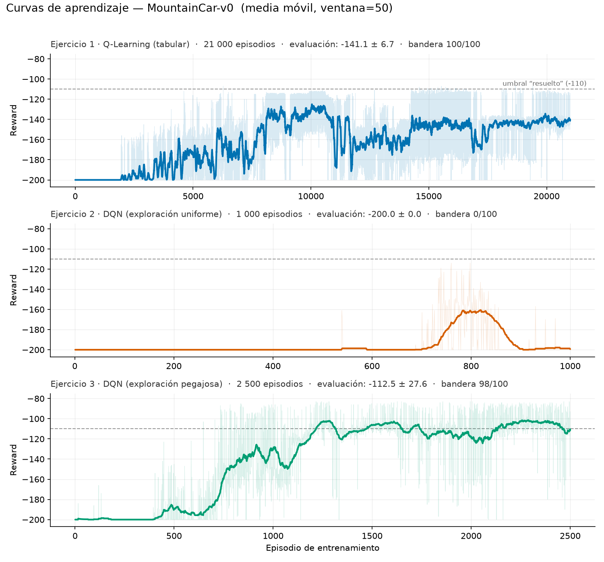
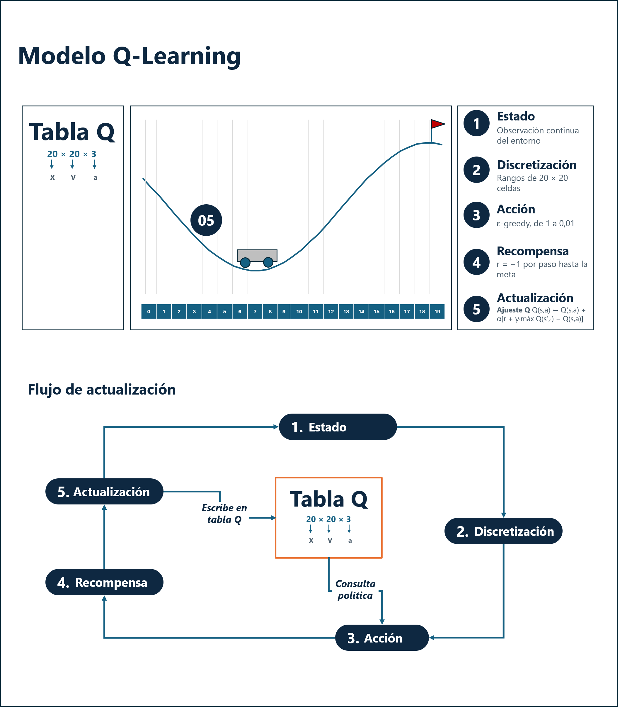
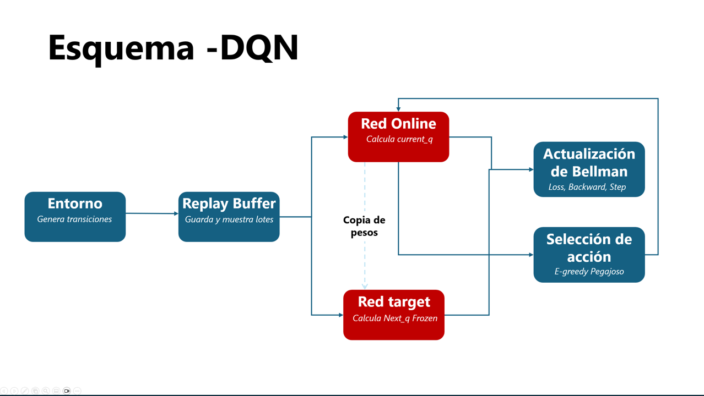
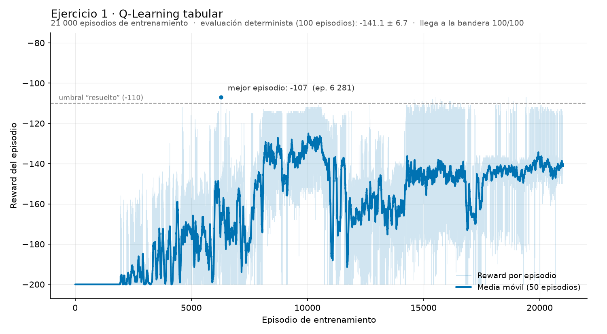
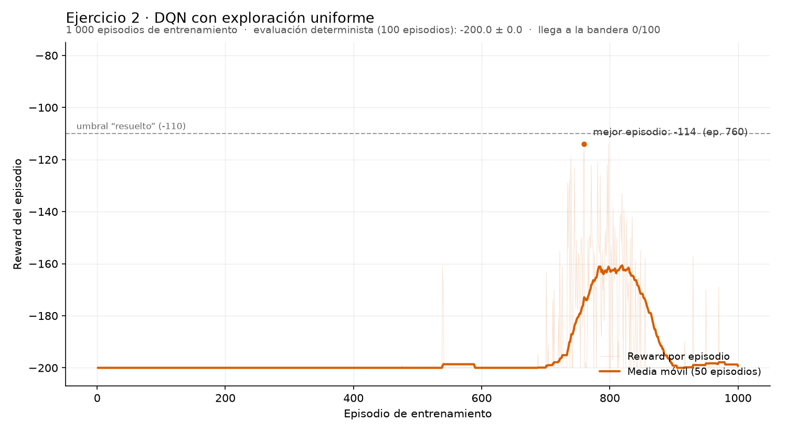
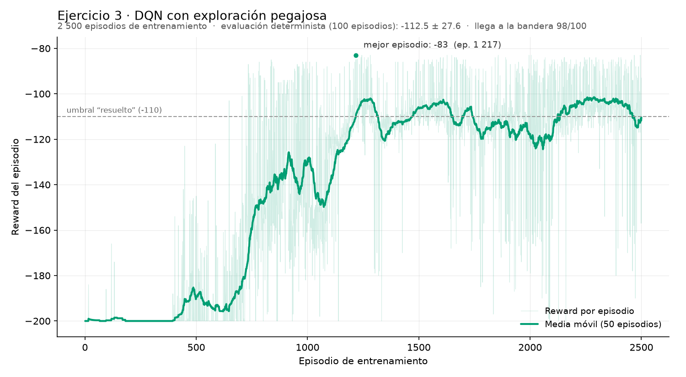
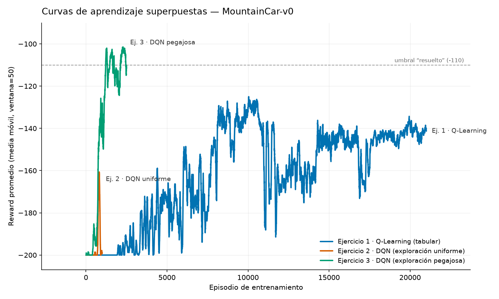

<div align="center">

# MountainCar-v0 — Aprendizaje por Refuerzo

*Q-Learning tabular y Deep Q-Network implementados desde cero, comparados y diagnosticados sobre un entorno de recompensa plana*

[](https://github.com/Marlon-Umbarila/mountain_car/actions/workflows/ci.yml)
[](pyproject.toml)
[](LICENSE)

[Resumen](#resumen) • [Instalación](#instalación) • [Uso](#uso) • [Estructura del repositorio](#estructura-del-repositorio) • [Proceso](#proceso-los-tres-ejercicios) • [Resultados](#resultados-y-evidencia)

</div>

---

## Resumen

Implementación desde cero y comparación de tres estrategias de aprendizaje por
refuerzo sobre el entorno [MountainCar-v0](https://gymnasium.farama.org/environments/classic_control/mountain_car/)
de Gymnasium: **Q-Learning tabular** (método clásico), **DQN con exploración
uniforme** (Deep RL, la versión de libro de texto) y **DQN con exploración
pegajosa** (Deep RL, la versión que sí funciona en este entorno).

Fork de práctica de [`emiliomunozai/mountain_car`](https://github.com/emiliomunozai/mountain_car).

**Grupo 10** — Maestría en Analítica Aplicada, Universidad de La Sabana:
Diego Rios · Nataly Valbuena · Marlon Umbarila · Nicolás Gamboa ·
Jorge Anaya · Andrés Díaz · Lorena Valero

### Qué incluye este repositorio

- **Tres agentes de RL escritos a mano** — ningún agente usa Stable-Baselines3
  ni librerías equivalentes: la red, el replay buffer, la red objetivo y los
  ciclos de entrenamiento están escritos a mano, de modo que cada parte del
  algoritmo es visible y editable.
- **CLI unificada** (`mountaincar`) para entrenar, evaluar, simular y grabar
  en video cualquiera de los agentes.
- **Pipeline reproducible** — scripts que entrenan, evalúan y generan todas
  las figuras y tablas de este README a partir de los mismos comandos.
- **Evidencia versionada** — CSV episodio a episodio, métricas de evaluación
  en JSON, figuras y videos del comportamiento aprendido, todo en el repo.
- **CI** con `ruff` (lint) y build del paquete en cada push.

> [!NOTE]
> Este README documenta tanto el **cómo usar** el proyecto como el **proceso
> de diseño y diagnóstico** detrás de los tres agentes. Si solo buscas
> reproducir los resultados, ve directo a [Instalación](#instalación) y
> [Uso](#uso). Si te interesa el razonamiento detrás de cada decisión, la
> sección [Proceso](#proceso-los-tres-ejercicios) lo cubre ejercicio por
> ejercicio.

### Resultado en una línea

| Agente | Episodios de entrenamiento | Evaluación determinista (100 ep.) | Llega a la bandera |
|---|---:|---:|---:|
| Ejercicio 1 · Q-Learning tabular | 21 000 | **−141.1 ± 6.7** | 100/100 |
| Ejercicio 2 · DQN exploración uniforme | 1 000 | **−200.0 ± 0.0** | 0/100 |
| Ejercicio 3 · DQN exploración pegajosa | 2 500 | **−112.5 ± 27.6** | 98/100 |

La recompensa es `−1` por paso hasta llegar a la bandera, con corte a 200
pasos: **menos negativo es mejor**, `−200` significa que el agente nunca llegó
y el umbral convencional de "resuelto" es `−110`.

**La estrategia más efectiva es el DQN con exploración pegajosa** (Ejercicio 3):
alcanza la meta en el 98 % de los episodios de evaluación con **8 veces menos
episodios de entrenamiento** que el agente tabular, y su media móvil de
entrenamiento se sostiene por encima del umbral de −110. El agente tabular es
más consistente (desviación de 6.7 frente a 27.6) pero nunca cruza ese umbral.



---

## El entorno MountainCar-v0

Un carrito está en un valle. Su motor es demasiado débil para subir
directamente por la colina derecha, así que la única salida es mecerse hacia
adelante y atrás para acumular impulso hasta alcanzar la bandera en la posición
`0.5`.

### Estado (observación) — 2 valores continuos

| Índice | Variable | Descripción | Rango |
|:---:|---|---|---|
| 0 | posición | Posición del carrito en el eje x | −1.2 a 0.6 |
| 1 | velocidad | Velocidad del carrito | −0.07 a 0.07 |

### Acciones — 3 discretas

| Valor | Acción |
|:---:|---|
| 0 | Acelerar a la izquierda |
| 1 | No acelerar |
| 2 | Acelerar a la derecha |

### Recompensas

| Evento | Recompensa |
|---|---|
| Cada paso | **−1** |
| Llegar a la bandera (posición ≥ 0.5) | el episodio termina |

Esta recompensa plana es lo que hace interesante a MountainCar: no hay ninguna
señal que indique al agente que se está acercando a la meta, así que tiene que
tropezar con la bandera por exploración antes de que haya algo que aprender.

---

## Instalación

Requiere Python 3.11 y [uv](https://docs.astral.sh/uv/).

```bash
git clone https://github.com/Marlon-Umbarila/mountain_car.git
cd mountain_car
uv sync
```

> [!TIP]
> Verificación rápida de que el entorno quedó bien instalado:
> ```bash
> uv run mountaincar inspect --steps 3
> ```
> Si imprime los espacios de estado/acción y un par de transiciones, todo está
> en orden y puedes pasar directo a [Uso](#uso).

## Uso

### CLI

Todo se expone a través del comando `mountaincar`:

```bash
uv run mountaincar <comando>
```

| Comando | Qué hace |
|---|---|
| `version` | Muestra la versión del paquete |
| `list` | Lista los agentes y si cada uno tiene archivo guardado |
| `inspect` | Imprime los espacios de estado/acción y algunas transiciones aleatorias |
| `init <agente>` | Crea un agente nuevo sin entrenar y lo guarda |
| `train <agente>` | Entrena un agente (retoma desde su archivo guardado si existe) |
| `load <agente>` | Muestra la información del agente guardado; con `--eval` lo evalúa |
| `sim <agente>` | Juega episodios paso a paso en la terminal |
| `render <agente>` | Juega episodios en una ventana gráfica |
| `delete <agente>` | Borra el archivo guardado de un agente |

`<agente>` es `qlearning` o `dqn`.

Sesión de ejemplo:

```bash
uv run mountaincar train qlearning --episodes 21000
uv run mountaincar load qlearning --eval
uv run mountaincar render qlearning --episodes 3
```

### Reproducir los resultados de este README

Los tres agentes se entrenan y evalúan con los scripts de `scripts/`. Cada uno
guarda el reward de **cada episodio** en un CSV dentro de `logs/`, el agente
entrenado en `saves/` y las métricas de evaluación en un JSON:

```bash
# Ejercicio 1 — Q-Learning tabular (~2 min)
uv run python scripts/run_qlearning.py

# Ejercicio 2 — DQN con exploración uniforme (stickiness = 0.0)  (~5 min)
uv run python scripts/run_dqn.py --tag ejercicio2_dqn --stickiness 0.0 --episodes 1000

# Ejercicio 3 — DQN con exploración pegajosa (stickiness = 0.9)  (~13 min)
uv run python scripts/run_dqn.py --tag ejercicio3_dqn --stickiness 0.9 --episodes 2500
```

Y luego las figuras y la tabla comparativa:

```bash
uv run python plot_learning_curves.py      # plots/learning_curves*.png
uv run python scripts/make_evidence.py     # plots/ejercicio*.png + logs/resumen_metricas.csv
```

Para grabar el comportamiento aprendido en video:

```bash
uv run python scripts/record_qlearning.py
uv run python scripts/record_videos.py
```

> [!NOTE]
> Los tiempos son de una máquina con 2 núcleos de CPU. Nada de esto necesita
> GPU: la red tiene 17 283 parámetros y el cuello de botella es avanzar el
> entorno, no multiplicar matrices.

---

## Estructura del repositorio

Vista rápida del árbol de carpetas y qué hace cada script:

```
src/mountain_car/
├── cli.py                    # CLI en argparse, un comando por función
└── agents/
    ├── qlearning.py          # Q-Learning tabular  (Ejercicio 1)
    └── dqn.py                # QNetwork, ReplayBuffer, DQNAgent  (Ejercicios 2 y 3)
scripts/
├── run_qlearning.py          # entrena + evalúa + registra el Ejercicio 1
├── run_dqn.py                # entrena + evalúa + registra los Ejercicios 2 y 3
├── make_evidence.py          # figuras por ejercicio + tabla comparativa
├── record_qlearning.py       # graba el agente tabular en video
└── record_videos.py          # graba los agentes DQN en video
plot_learning_curves.py       # figura comparativa de las tres curvas
logs/                         # CSV episodio a episodio + métricas de evaluación
plots/                        # figuras generadas
videos/                       # comportamiento aprendido, en video
docs/                         # esquemas del ciclo de entrenamiento
Documentacion/                # documento consolidado del proyecto (.docx)
saves/                        # agentes entrenados (no versionado)
EXERCISES.md                  # enunciado original de los ejercicios
```

Y, con más detalle práctico — qué es cada cosa y cuándo la vas a necesitar:

| Ruta | Contenido | Cuándo entrar aquí |
|---|---|---|
| `src/mountain_car/cli.py` | Comando `mountaincar` (argparse): `train`, `load`, `sim`, `render`, `inspect`, etc. | Para agregar un comando nuevo a la CLI o entender qué hace cada uno. |
| `src/mountain_car/agents/qlearning.py` | `QLearningAgent`: discretización, tabla Q, epsilon-greedy, actualización TD. | Para revisar o modificar la lógica del Ejercicio 1. |
| `src/mountain_car/agents/dqn.py` | `QNetwork`, `ReplayBuffer`, `DQNAgent`: red, buffer, red objetivo, exploración pegajosa. | Para revisar o modificar la lógica de los Ejercicios 2 y 3. |
| `scripts/run_qlearning.py`, `scripts/run_dqn.py` | Entrenan un agente de punta a punta, evalúan 100 episodios deterministas y guardan CSV + JSON. | Para reproducir cualquiera de los tres resultados del README. |
| `scripts/make_evidence.py` | Genera las figuras por ejercicio y `logs/resumen_metricas.csv` a partir de los CSV crudos. | Después de entrenar, para regenerar las gráficas y la tabla comparativa. |
| `scripts/record_qlearning.py`, `scripts/record_videos.py` | Graban episodios jugados por un agente ya entrenado. | Para producir los `.mp4` de `videos/`. |
| `plot_learning_curves.py` | Genera la figura comparativa de las tres curvas de aprendizaje superpuestas. | Para regenerar `plots/learning_curves*.png`. |
| `logs/` | Un CSV por agente con el reward de **cada episodio**, más un JSON de evaluación por agente y el resumen comparativo. | Fuente de verdad de todos los números que aparecen en este README. |
| `plots/` | Todas las figuras `.png` generadas por los scripts anteriores. | Para ver o reutilizar las gráficas sin tener que regenerarlas. |
| `videos/` | Clips `.mp4` del comportamiento aprendido de cada agente. | Para ver a los agentes jugar sin instalar nada. |
| `docs/` | Esquemas dibujados a mano del ciclo de entrenamiento de cada agente (requisito de la rúbrica). | Para consultar o actualizar los diagramas referenciados más abajo. |
| `Documentacion/` | Entrega consolidada del proyecto en `.docx`. | Documento formal para la entrega del curso, no necesario para correr el código. |
| `saves/` | Pesos/tablas de los agentes ya entrenados (`.pkl`, `.pt`). No está versionado. | Se genera solo al correr `train`/`run_*`; bórralo con `mountaincar delete <agente>` para reentrenar desde cero. |
| `EXERCISES.md` | Enunciado original de los tres ejercicios tal como se recibió. | Para ver qué se pedía antes de leer cómo se resolvió, en la sección de abajo. |
| `pyproject.toml` | Dependencias, versión de Python y punto de entrada de la CLI. | Para agregar una dependencia nueva o revisar los requisitos exactos. |

---

## Proceso: los tres ejercicios

El repositorio original deja escrito todo el andamiaje (CLI, ciclos de
entrenamiento, guardado/carga, logging) y deja como bloques `EXERCISE`
únicamente las piezas centrales del algoritmo. El trabajo consistió en
completarlas, en este orden.

### Ejercicio 1 — Q-Learning tabular

Archivo: `src/mountain_car/agents/qlearning.py`

Una tabla Q necesita claves discretas, pero la observación de MountainCar es
continua. Se divide cada dimensión en `n_bins = 20` intervalos, lo que da una
rejilla de 20 × 20 = 400 celdas.

- **`discretize`** — `np.linspace(lo, hi, n_bins + 1)[1:-1]` deja los 19 cortes
  interiores por dimensión y `np.digitize` devuelve el índice del intervalo. La
  función retorna una tupla de dos enteros, hasheable, que sirve de clave.
- **`select_action`** — epsilon-greedy: con probabilidad `epsilon` explora al
  azar, si no toma `argmax` de la fila de la tabla. `deterministic=True` fuerza
  siempre la rama de explotación; es el modo que usan la evaluación y el
  renderizado.
- **`_update`** — el objetivo TD es `reward + gamma · max Q(s', ·)`, o
  simplemente `reward` cuando `terminated` es verdadero. La actualización se
  escribe directamente sobre `self.q_table[state][action]`.

**Tropiezo encontrado:** al primer entrenamiento salió `random is not defined`,
porque el módulo no tenía `import random`. Se agregó junto a los demás imports
de la librería estándar.

**Resultado:** después de 21 000 episodios el agente visita 297 de las 400
celdas posibles y llega a la bandera en **100 de 100** episodios de evaluación,
con un reward medio de **−141.1 ± 6.7**.

### Ejercicio 2 — Deep Q-Network

Archivo: `src/mountain_car/agents/dqn.py`

La tabla se reemplaza por una red neuronal que aproxima `Q(s, a)`: ya no hace
falta discretizar y el agente generaliza entre observaciones parecidas en lugar
de memorizar celdas exactas.

- **`QNetwork`** — un MLP `2 → 128 → 128 → 3` con ReLU entre capas ocultas y
  **sin activación en la salida**, porque los Q-values son estimaciones de
  retorno (aquí siempre negativas), no probabilidades.
- **`_learn`** — `gather(1, actions_t)` selecciona el Q-value de la acción
  tomada, pasando de `(batch, 3)` a `(batch, 1)`. `next_q` se calcula con
  `self.target_net` dentro de `torch.no_grad()`: si el gradiente fluyera hacia
  el objetivo, la red perseguiría un blanco que se mueve con cada paso. El
  factor `(1 − terminated)` anula el bootstrap solo en transiciones terminales
  reales — y usa `terminated`, no `terminated or truncated`, porque llegar al
  límite de 200 pasos no es un final real del episodio.

**Tropiezo encontrado:** `Module [QNetwork] is missing the required forward
function`. Era un problema de indentación: `forward()` había quedado fuera del
cuerpo de la clase, así que PyTorch caía en la implementación por defecto de
`nn.Module`. Se corrigió alineándola con `__init__()`.

**Resultado:** el código es correcto y aun así el agente **no aprende**. Su
evaluación determinista es **−200.0 ± 0.0, con 0 de 100 episodios llegando a la
bandera**. Ese fracaso es el punto de partida del Ejercicio 3.

### Ejercicio 3 — Diagnóstico y corrección de la exploración

Archivo: `src/mountain_car/agents/dqn.py`, método `select_action`

**Diagnóstico.** La recompensa es `−1` en cada paso sin importar la acción. Si
el agente nunca llega a la bandera, todos los estados valen lo mismo: el punto
fijo teórico es `−1 / (1 − gamma) = −100` con `gamma = 0.99`. La red aprende
exactamente eso — que ninguna acción importa — lo cual, dados los datos que vio,
es cierto. **El problema está aguas arriba del aprendizaje: en cómo se recolectan
los datos.**

Escapar del valle exige rachas sostenidas de empuje en una misma dirección. La
exploración epsilon-greedy estándar sortea una acción independiente en cada
paso, así que la probabilidad de mantener ~20 pasos en la misma dirección por
azar es del orden de `(1/3)^20` ≈ 3 en 10 000 millones. No es mala suerte: el
comportamiento que se necesita es, en la práctica, inalcanzable para esa
exploración. Agregar episodios nunca lo arregla.

**Corrección — exploración pegajosa (*sticky* epsilon-greedy).** Se agrega un
hiperparámetro `stickiness` (0.9 por defecto): al explorar, con esa probabilidad
se repite la última acción exploratoria en lugar de sortear una nueva. Las
acciones consecutivas dejan de ser independientes y la exploración pasa de un
temblor aleatorio a un impulso sostenido — como un niño en un columpio que
mantiene el mismo sentido de bombeo varios pasos seguidos.

No se tocan la red, la regla de aprendizaje, la recompensa ni el entorno.
Detalles de implementación:

- `self._last_explore_action` se reinicia a `None` al comienzo de cada episodio
  dentro de `train()`, para que la racha no se arrastre entre episodios.
- `stickiness` se agregó a la tupla `_HPARAMS` para que `save()`/`load()` lo
  persistan.
- `deterministic=True` sigue siendo 100 % greedy: el cambio afecta únicamente la
  rama de exploración, así que las cifras de evaluación siguen siendo válidas.

**Tropiezo encontrado:** al reanudar el entrenamiento salió `KeyError:
'stickiness'`, porque el archivo en `saves/` correspondía a un agente entrenado
antes de agregar el hiperparámetro. Se resolvió con `uv run mountaincar delete
dqn` y reentrenando desde cero.

**Resultado:** **−112.5 ± 27.6 con 98 de 100** episodios llegando a la bandera,
partiendo de 0 de 100. Un cambio de unas pocas líneas, localizado en una sola
rama de `select_action`.

---

## Esquemas del ciclo de entrenamiento

| Q-Learning tabular | DQN |
|---|---|
|  |  |

> [!IMPORTANT]
> Ambos esquemas son dibujo propio del equipo (a mano, en Excalidraw o
> PowerPoint) siguiendo el guion detallado en [`docs/README.md`](docs/README.md).
> La rúbrica del curso asigna 0 puntos a un esquema ausente o autogenerado por IA.

---

## Resultados y evidencia

### Ejercicio 1 — Q-Learning tabular



**Mejor resultado: −107 en el episodio 6 281; evaluación determinista de
−141.1 ± 6.7 con 100/100 episodios llegando a la bandera.**

La curva sube desde −200 a partir del episodio ~2 000 y se estabiliza alrededor
de −140. El detalle interesante es que **nunca cruza el umbral de −110**: la
discretización en 400 celdas pone un techo al desempeño, porque toda
observación que caiga en la misma celda es indistinguible para el agente y no
puede afinar más la política. A cambio, es el agente más consistente de los
tres — su desviación de 6.7 es cuatro veces menor que la del DQN.

### Ejercicio 2 — DQN con exploración uniforme



**Mejor resultado: −200.0 ± 0.0 con 0/100 episodios llegando a la bandera. El
agente no aprende.**

Hay que leer esta curva con cuidado, porque muestra algo más matizado que una
línea plana. Entre los episodios ~700 y ~900 aparece una joroba: 110 de los
1 000 episodios de entrenamiento sí terminaron antes del límite de pasos, y la
media móvil llega a subir hasta −160. Pero **el aprendizaje se desploma de
vuelta a −200 y nunca se consolida**: los últimos 200 episodios están todos en
−200, y la política greedy final evalúa en −200.0 exacto, 0 de 100. Esos
éxitos ocasionales llegaron mientras `epsilon` todavía inyectaba ruido, no de
la política aprendida, y nunca fueron suficientes ni lo bastante sostenidos
para que la red aprendiera a causarlos.

### Ejercicio 3 — DQN con exploración pegajosa



**Mejor resultado: −83 en el episodio 1 267; evaluación determinista de
−112.5 ± 27.6 con 98/100 episodios llegando a la bandera.**

Misma red, mismo `_learn`, mismo entorno, misma recompensa: lo único que cambió
es `stickiness` de 0.0 a 0.9. La curva despega hacia el episodio ~700 y se
sostiene por encima de −110 desde el episodio ~1 250 en adelante. Su punto
débil es la variabilidad: la desviación de 27.6 viene de los 2 episodios (de
100) en los que la política falla y agota los 200 pasos — la posición inicial
de `env.reset()` es aleatoria y en algunas de ellas la política aprendida no
alcanza a acumular impulso.

### Comparación



| Métrica | Ej. 1 · Q-Learning | Ej. 2 · DQN uniforme | Ej. 3 · DQN pegajosa |
|---|---:|---:|---:|
| Episodios de entrenamiento | 21 000 | 1 000 | 2 500 |
| Reward medio, últimos 50 ep. | −141.3 | −199.3 | **−110.4** |
| Mejor media móvil (ventana 50) | −125.0 | −160.7 | **−101.5** |
| Mejor episodio individual | −107 | −114 | **−83** |
| Evaluación determinista (100 ep.) | −141.1 ± 6.7 | −200.0 ± 0.0 | **−112.5 ± 27.6** |
| Llega a la bandera | 100/100 | 0/100 | **98/100** |
| ¿Supera el umbral de −110? | No | No | **Sí, en entrenamiento** |

Los números están en `logs/resumen_metricas.csv`, generado por
`scripts/make_evidence.py` a partir de los CSV episodio a episodio.

### Conclusión

Comparando las tres estrategias, **la más efectiva es el DQN con exploración
pegajosa**: llega a la bandera en el 98 % de los episodios de evaluación con
una octava parte de los episodios de entrenamiento que necesita el agente
tabular, y es el único de los tres cuya media móvil de entrenamiento supera el
umbral convencional de "resuelto".

El hallazgo central no es cuál algoritmo gana, sino **por qué** el Ejercicio 2
pierde. La comparación entre los Ejercicios 2 y 3 aísla una sola variable —la
estructura estadística de la exploración— manteniendo constante todo lo demás.
En un entorno de recompensa plana como MountainCar, no basta con explorar
*mucho* (`epsilon` alto): la exploración tiene que ser capaz de **emitir la
forma de comportamiento** que la tarea exige. Una exploración sin correlación
temporal jamás produce la racha sostenida que se necesita para escapar del
valle, y ninguna cantidad de episodios ni de capacidad de red compensa eso,
porque el fallo ocurre en la recolección de datos, no en el aprendizaje.

Si el objetivo fuera la consistencia por encima del desempeño máximo, el agente
tabular sigue siendo defendible: nunca falla un episodio y su desviación es
cuatro veces menor.

### Un intento de afinar el DQN (y por qué no se adoptó)

La hipótesis natural para acercar el DQN a la referencia de −106 es entrenarlo
más tiempo y sincronizar la red objetivo con más frecuencia. Se probó:
4 000 episodios, `target_update_freq = 5`, `epsilon_decay = 0.997`.

```bash
uv run python scripts/run_dqn.py --tag ejercicio3_dqn_afinado \
    --stickiness 0.9 --episodes 4000 --target-update-freq 5 --epsilon-decay 0.997
```

| | Ej. 3 (2 500 ep.) | Afinado (4 000 ep.) |
|---|---:|---:|
| Mejor media móvil (ventana 50) | **−101.5** | −103.6 |
| Media móvil al terminar | **−110.4** | −126.1 |
| Media de los últimos 500 episodios | **−108.2** | −134.6 |
| Evaluación determinista (100 ep.) | **−112.5 ± 27.6** | −134.2 ± 22.1 |
| Llega a la bandera | 98/100 | **100/100** |
| Peor episodio de evaluación | −200 | **−168** |

**Entrenar más no mejoró el resultado: lo empeoró.** Ambas configuraciones
alcanzan prácticamente el mismo pico (−101.5 vs −103.6), pero la afinada no lo
sostiene: su media móvil oscila entre −108 y −153 en los últimos 800 episodios
y termina 16 puntos por debajo de donde estaba en su mejor momento. Es
inestabilidad clásica de DQN — la red sigue actualizándose sobre un buffer
dominado por trayectorias recientes y olvida parte de lo aprendido.

La versión afinada sí gana en fiabilidad (100/100 episodios y un peor caso de
−168 frente a −200), así que la elección depende del criterio: **−112.5 con un
2 % de fallos si importa el reward medio, −134.2 sin fallos si importa no
quedarse nunca atascado.** Se mantiene la configuración de 2 500 episodios como
la principal porque es la que compite con el umbral de −110, y se deja esta
prueba documentada porque descarta explícitamente la vía de "entrenar más
episodios". Sus registros están en `logs/ejercicio3_dqn_afinado.csv`.

---

<div align="center">

Apache-2.0 — ver [LICENSE](LICENSE)

</div>
